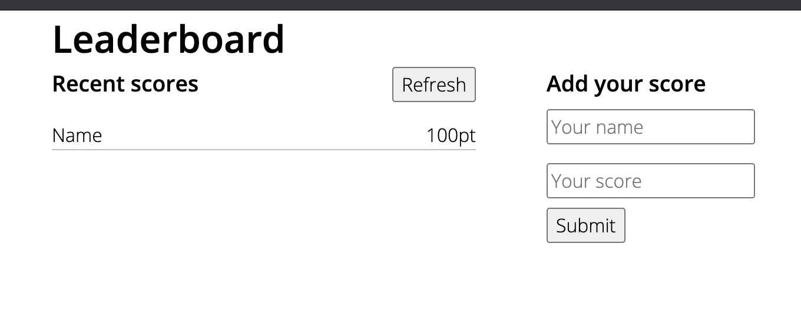

# Project Leaderboard: setup project

> In this activity I will set up a JavaScript project for the Leaderboard list app, using webpack and ES6 features, notably modules. Here I should develop a first working version of the app following a wireframe, but without styling - just focus on functionality. In following activities, I will consume the Leaderboard API using JavaScript async and await and add some styling.

Additional description about the project and its features.

## Built With

- JavaScript
- Webpack

## Live Demo

[Live Demo Link](https://livedemo.com)

## Getting Started

To get a local copy up and running follow these simple example steps.

### Prerequisites

### Setup

### Install

### Usage

### Run tests

### Deployment

## Authors

👤 MARIJAN BRVAR

- GitHub: [@githubhandle](https://github.com/marijanbrvar)
- Twitter: [@twitterhandle](https://twitter.com/marijanbrvar)
- LinkedIn: [LinkedIn](https://linkedin.com/in/marijanbrvar)

## 🤝 Contributing

Contributions, issues, and feature requests are welcome!

Feel free to check the [issues page](issues/).

## Show your support

Give a ⭐️ if you like this project!

## Acknowledgments

- Hat tip to anyone whose code was used
- Inspiration
- etc

## 📝 License

This project is [MIT](lic.url) licensed.
