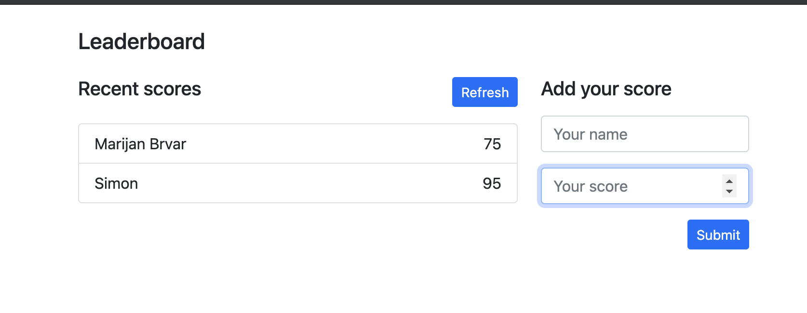

# Project Leaderboard: setup project

> In this activity, I will set up a JavaScript project for the Leaderboard list app, using webpack and ES6 features, notably modules. Here I should develop a first working version of the app following a wireframe, but without styling - focus on functionality. I will consume the Leaderboard API using JavaScript async and await and add some styling in the following activities.

## Built With

- JavaScript
- Webpack

## Live Demo

[Live Demo Link](https://marijanbrvar.github.io/Leaderboard/)

## Getting Started

To get a local copy up and running, follow these simple example steps.
`git clone git@github.com:marijanbrvar/Leaderboard.git && cd Leaderboard`
then run
`npm install` to update local dependencies
, that's all, and now you can run `npm start.`

### Prerequisites
Node 14.xx >
Modern browser like Chrome, Safari ...

### Usage
In the form on the right side, enter your name and score.  The list will be populated automatically in the list on the left side!

## Authors

👤 MARIJAN BRVAR

- GitHub: [@githubhandle](https://github.com/marijanbrvar)
- Twitter: [@twitterhandle](https://twitter.com/marijanbrvar)
- LinkedIn: [LinkedIn](https://linkedin.com/in/marijanbrvar)

## 🤝 Contributing

Contributions, issues, and feature requests are welcome!

Feel free to check the [issues page](https://github.com/marijanbrvar/Leaderboard/issues).

## Show your support

Give a ⭐️ if you like this project!

## Acknowledgments

- Hat tip to anyone who's code was used
- Inspiration
- etc

## 📝 License

This project is [MIT](https://github.com/marijanbrvar/Leaderboard/blob/01-basic_layout/LICENSE) licensed.
